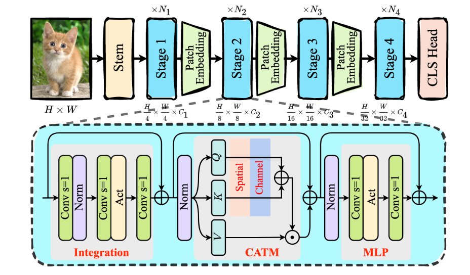
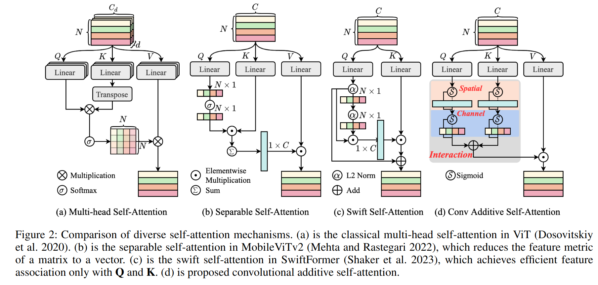
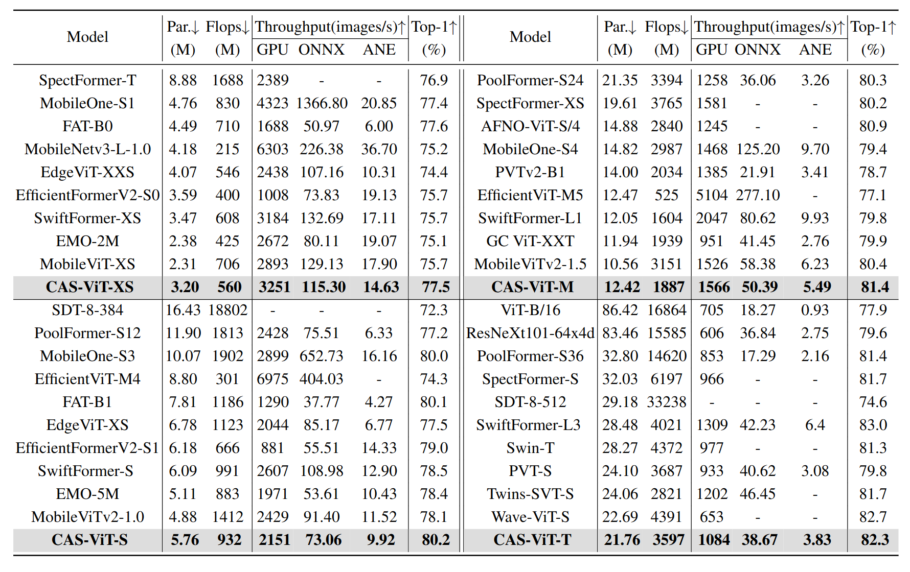

# Conformer

> [CAS-ViT: Convolutional Additive Self-attention Vision Transformers for Efficient Mobile Applications](https://arxiv.org/abs/2408.03703)

<!-- [ALGORITHM] -->

## Abstract

Vision Transformers (ViTs) mark a revolutionary advance in neural networks with their token mixer's powerful global context capability. However, the pairwise token affinity and complex matrix operations limit its deployment on resource-constrained scenarios and real-time applications, such as mobile devices, although considerable efforts have been made in previous works. In this paper, we introduce CAS-ViT: Convolutional Additive Self-attention Vision Transformers, to achieve a balance between efficiency and performance in mobile applications. Firstly, we argue that the capability of token mixers to obtain global contextual information hinges on multiple information interactions, such as spatial and channel domains. Subsequently, we construct a novel additive similarity function following this paradigm and present an efficient implementation named Convolutional Additive Token Mixer (CATM). This simplification leads to a significant reduction in computational overhead. We evaluate CAS-ViT across a variety of vision tasks, including image classification, object detection, instance segmentation, and semantic segmentation. Our experiments, conducted on GPUs, ONNX, and iPhones, demonstrate that CAS-ViT achieves a competitive performance when compared to other state-of-the-art backbones, establishing it as a viable option for efficient mobile vision applications.

<div align=center>

</div>

<div align=center>

</div>

## How to use it?

<!-- [TABS-BEGIN] -->

**Use the model**

Use the model according to the [docs](https://mmpretrain.readthedocs.io/en/latest/user_guides/inference.html).

```python
import torch
from mmpretrain import get_model

model = get_model('casvit-small_8xb256_in1k', pretrained="your_local_checkpoint_path")
inputs = torch.rand(1, 3, 224, 224)
out = model(inputs)
print(type(out))
# To extract features.
feats = model.extract_feat(inputs)
print(type(feats))
```


**Use the official ckpt**

Download the official ckpt according to the [MODEL_ZOO](https://github.com/Tianfang-Zhang/CAS-ViT/blob/main/MODEL_ZOO.md).

Converted:

```shell
python tools/model_converters/casvit_to_mmpretrain.py ptah/to/official_ckp.pth path/to/mmpretrain_ckpt.pth
```

**Train/Test Command**

Prepare your dataset according to the [docs](https://mmpretrain.readthedocs.io/en/latest/user_guides/dataset_prepare.html#prepare-dataset).

Train:

```shell
python tools/train.py configs/casvit/casvit-small_8xb256_in1k.py
```

Test:

```shell
python tools/test.py configs/casvit/casvit-small_8xb256_in1k.py path/to/pth
```

<!-- [TABS-END] -->

## Models and results

### Image Classification on ImageNet-1k

<div align=center>

</div>

*Models are converted from the [official repo](https://github.com/Tianfang-Zhang/CAS-ViT). The config files of these models are only for inference. I haven't reproduce the training results.*

## Citation

```bibtex
@article{zhang2024casvitconvolutionaladditiveselfattention,
      title={CAS-ViT: Convolutional Additive Self-attention Vision Transformers for Efficient Mobile Applications}, 
      author={Tianfang Zhang and Lei Li and Yang Zhou and Wentao Liu and Chen Qian and Xiangyang Ji},
      year={2024},
}
```
